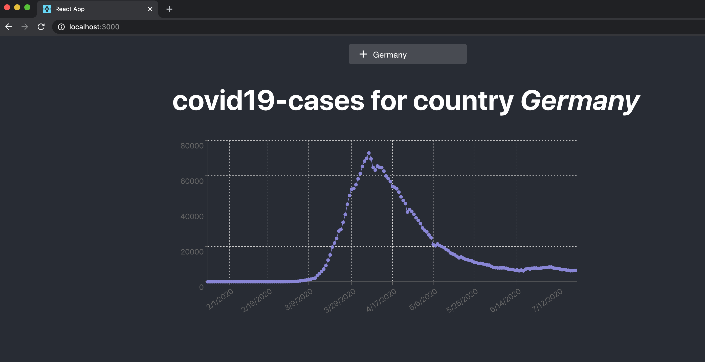

## Project

This project is a simple react app which displays the active cases of the searched country.



You can try and start the page with the following command:
```
yarn start
```

On the project there is a Azure Function reference (optional). You can start the function locally when installing the *Azure Function Core Tools*.
 